VMWare 14.1.2 安装 macOS High Sierra 10.13.6 虚拟机
===================================================

## 1 下载并安装 vmware 14.1.2

### 1.1 下载

* Windows 版本[下载地址](http://download3.vmware.com/software/wkst/file/VMware-workstation-full-14.1.2-8497320.exe)

```
md5sum: 79935903c0c0ed415ef965751c9c5b15
sha256sum: 33caa5ddac80f75dfd17215eeafab46856dfa7f45219260f7663f4a583cfd0c0
```

* Linux 版本[下载地址](http://download3.vmware.com/software/wkst/file/VMware-Workstation-Full-14.1.2-8497320.x86_64.bundle)

```
md5sum: f077c30d037b85e30eb8187d970498bc
sha256sum: 8932c681a8954c4aaf0e7d0039c6d8dff9ade323170d9a9a78553c98ffe16963
```
### 1.2 安装

安装过程很简单，只是到安装最后需要有许可密钥（[网上有现成的可用](https://www.baidu.com/s?ie=utf-8&f=3&rsv_bp=1&rsv_idx=1&tn=baidu&wd=vmware%2014%20%E5%AF%86%E9%92%A5&oq=vmware%252014&rsv_pq=84d563ad0000fbdf&rsv_t=18dcXH7Ve4XYyqVZFsdWJa2NTt7AXXl85LnnfUgzgdra7KGO%2FrQu2clxf%2F8&rqlang=cn&rsv_enter=1&rsv_sug3=2&rsv_sug1=2&rsv_sug7=100&rsv_sug2=1&prefixsug=vmware%252014%2520&rsp=0&inputT=844&rsv_sug4=1296&rsv_sug=1)）

### 1.3 安装 vmware 对 macOS 的支持: unlocker

#### 1.3.1 下载 unlocker

* google 硬盘[下载地址](https://drive.google.com/open?id=1C3glzUEv0NCYb9uo0FZL_XvukGYs5yC8)
* 百度网盘[下载地址](https://pan.baidu.com/s/17drFWnDZwUTT5gflHS5ODg)

```
md5sum: 01b10966b0a466a80dcb137d181aa4ba
sha256sum: be9b9692e43ddb695dab37c36d7b0f006df8c6358c682fa4ee2c6325fbc18b29
```

#### 1.3.2 安装 unlocker

下载 `unlocker.zip` 后解压然后以管理员身份执行 `win-install.bat`。


---


## 2 安装 macOS High Sierra 10.13.6


### 2.1 下载ISO镜像

* google 硬盘[下载地址](https://drive.google.com/open?id=1q8cWD1rJoKTExsehx3-wnwEq7SNCMeY7)
* 百度网盘[下载地址](https://pan.baidu.com/s/1_vRuHpvuoMLfv63qC0z0JQ)

```
md5sum: af8d962f691cc615d28e1f2498aaf882
sha256sum: d4a1d635bedf9b806770e8c876818d5966546a1d6bd7dcb63d75a062df0bfdbc
```

### 2.2 安装 macOS

#### 2.2.1 新建虚拟机

打开 VMWare 软件，点击 `创建新的虚拟机`，然后选择 `典型(推荐)(T)`，再点击 `下一步` 得到如下界面

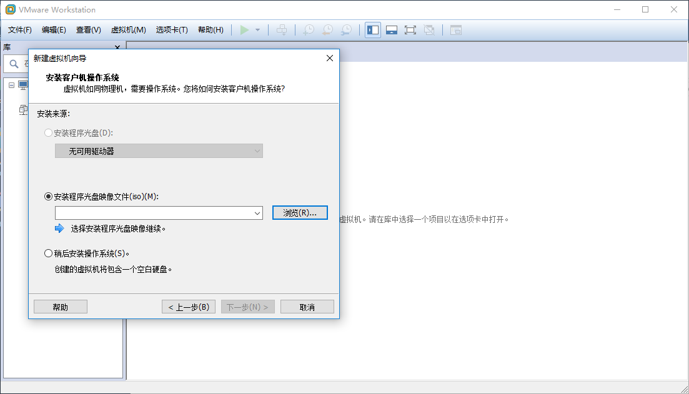

#### 2.2.2 选择 ISO 镜像

执行这一步之前必须已经下载完 macOS 系统镜像。如果已经下载完成，则选择 `安装程序光盘映像文件`，然后点击 `浏览`，选择你的镜像文件。

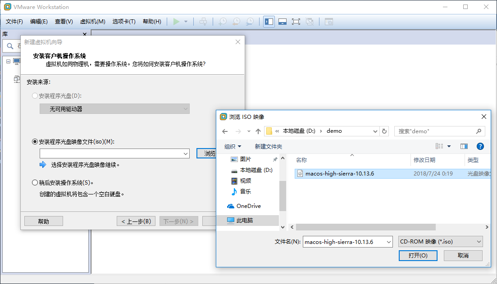

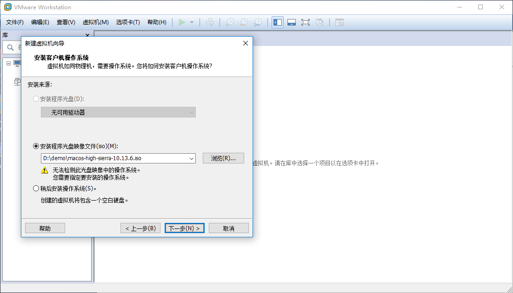

#### 2.2.3 选择系统类型

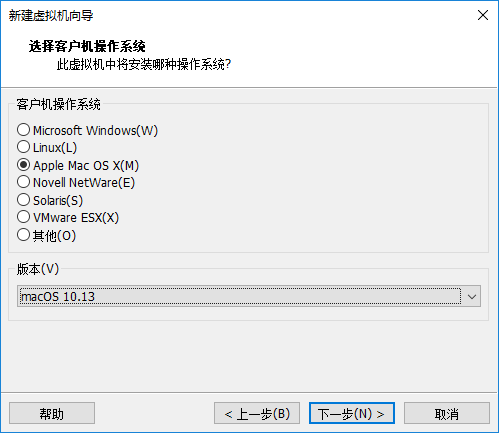

#### 2.2.4 设定虚拟机名称和虚拟机存放位置

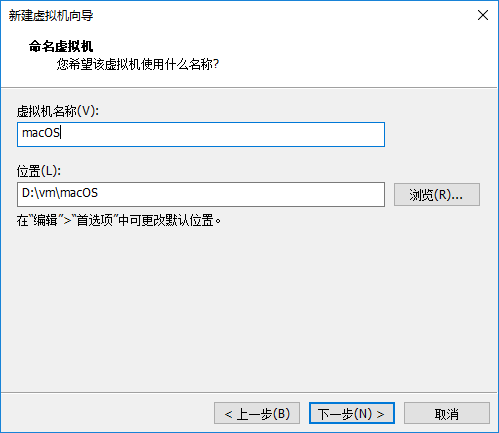

#### 2.2.5 设定磁盘容量和划分方式

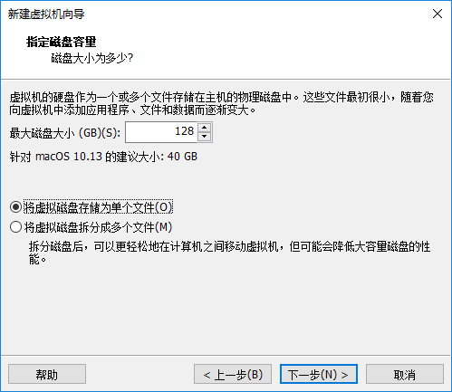

#### 2.2.6 修改虚拟机配置文件

在前面设定的虚拟机存储目录中找到后缀为 `vmx` 的文件，如果是按前面途中所示给虚拟机取名为 `macOS`，那么这个文件就是 `macOS.vmx`。修改这个文件，如下图所示，使用记事本或其他任何文本编辑器打开文件（不要双击该文件，双击会默认使用 VMWare 打开虚拟机），然后在 `smc.present = "TRUE"` 这一行下面添加一行

```
smc.version = 0
```

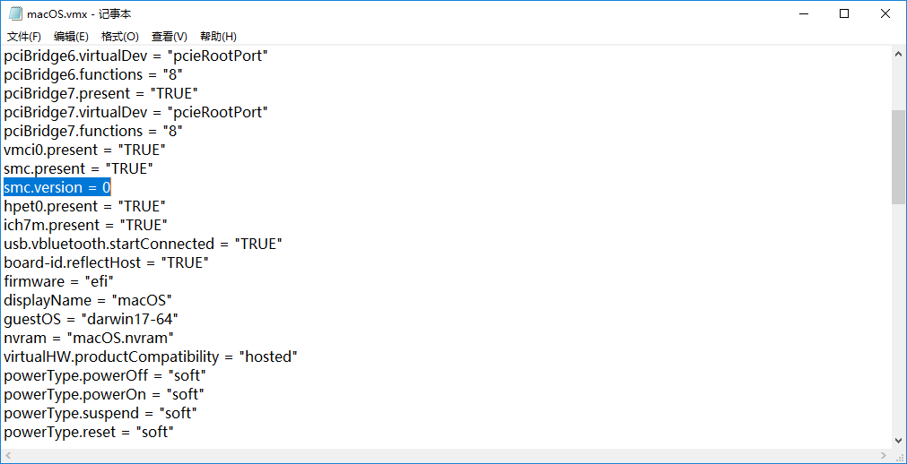

然后就可以去启动虚拟机了，启动需要一定时间，应当可以看到如下图的进度图

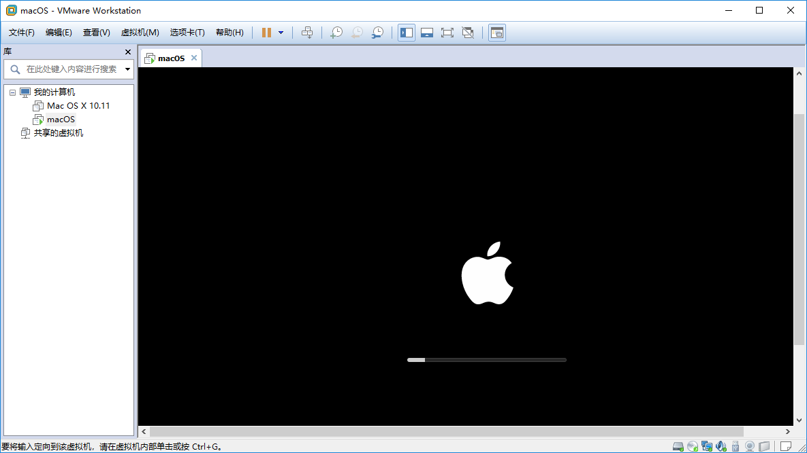

#### 2.2.7 安装系统

首先需要选择系统语言再进入`下一步`

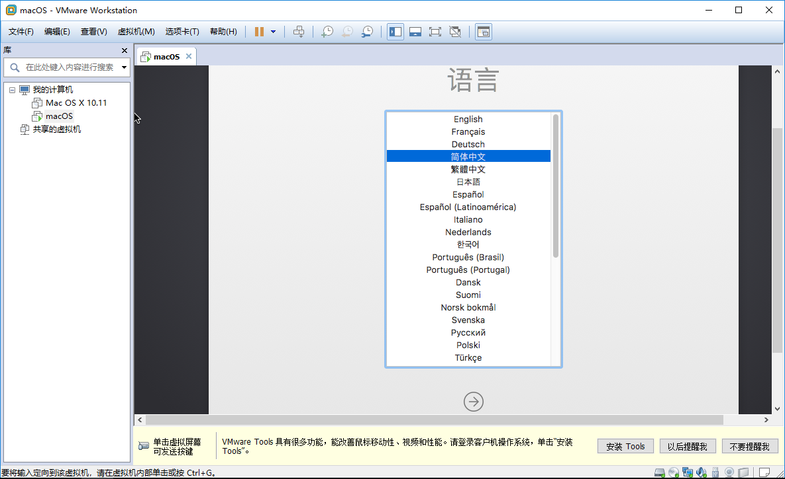

然后再选择`磁盘工具`后`继续`


进入磁盘工具后，在左侧选中 `VMWare Virtual SATA...`，然后顶部的 `抹掉` 按钮，然后在弹出框中给磁盘取名，下图所示取得名字为 `os`，区域两个选项保持默认即可，最后点击`抹掉`。抹掉成功后关掉磁盘工具窗口

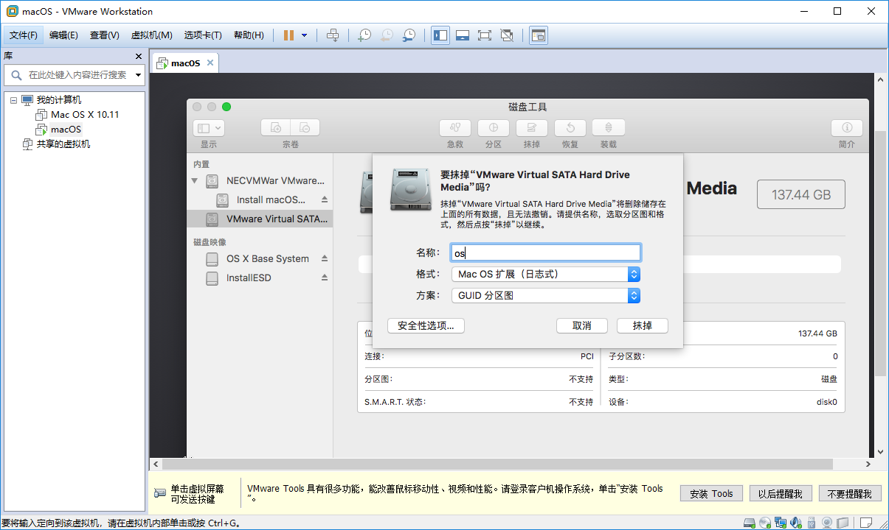

然后选择`安装 macOS`再`继续`


接下来选择安装位置，就选择刚才抹掉的磁盘，选好之后点击`安装`

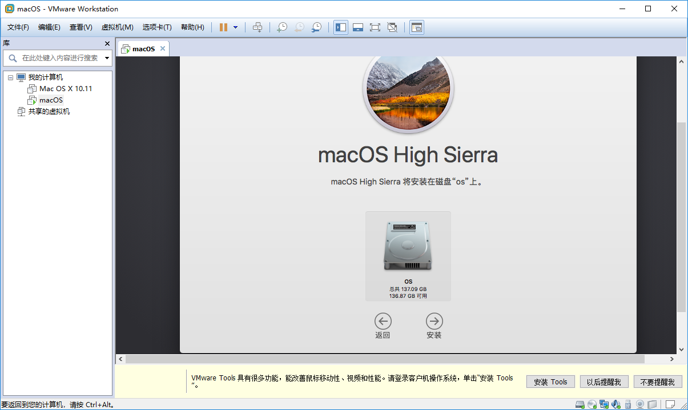

然后是安装过程，需要等待一段时间

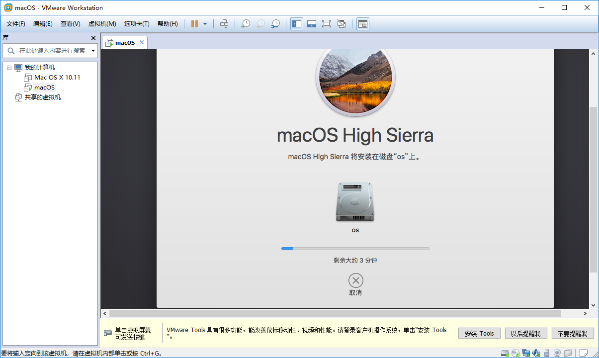

之后虚拟机系统重启安装，也需要等待一段时间

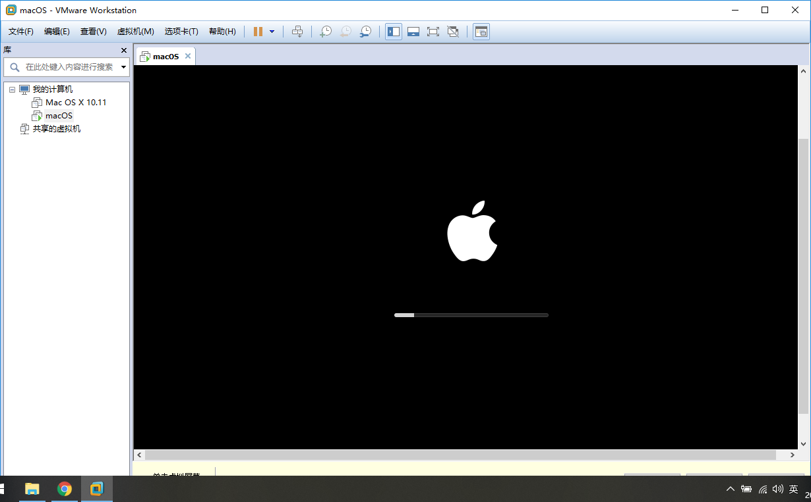

#### 2.2.8 系统设置

主要就是一些选择地区，设置账号密码等等，这些就自行设置了。

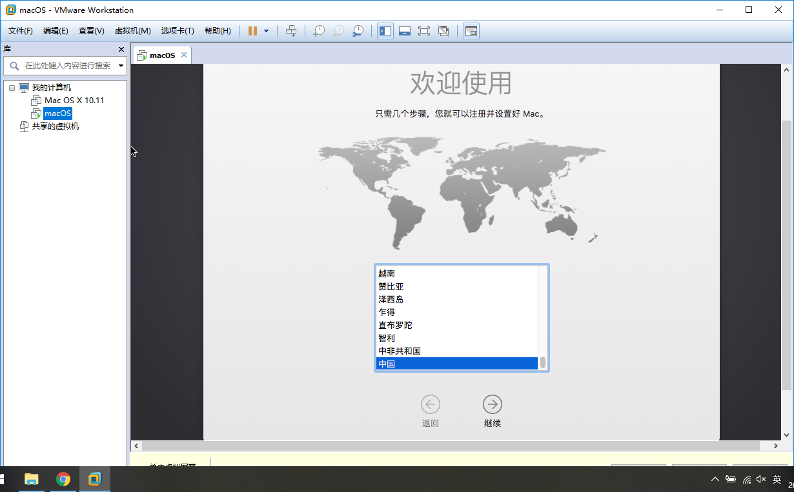

### 2.3 安装扩展工具(VMWare Tools)

首先关闭虚拟机，然后`编辑虚拟机设置`

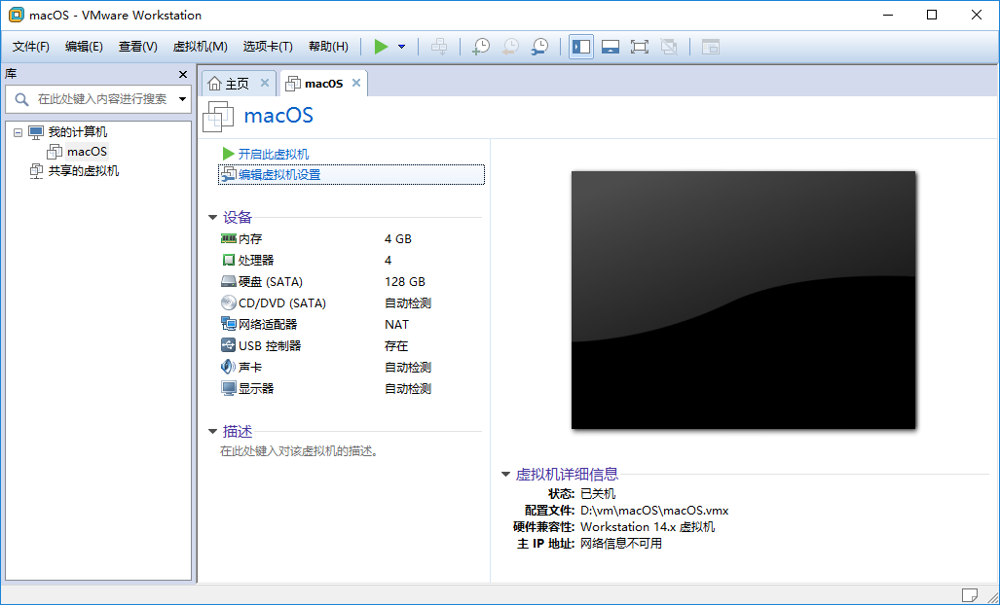

在 `硬件 -> CD/DVD(SATA) -> 连接` 中选择 `使用ISO镜像文件`，再点击旁边的 `浏览` 按钮选择 ISO 文件，这个 ISO 文件为 `C:\Program Files(x86)\VMWare\VMWare Workstation\darwin.iso`。选好之后`确定`，然后启动虚拟机。

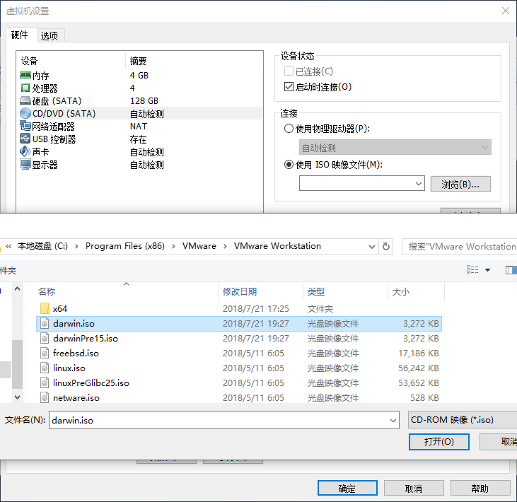

启动后，双击虚拟内的桌面上的 `VMWare Tools`，在弹出框中再双击 `安装 VMWare Tools`，然后按指示一步步完成安装。

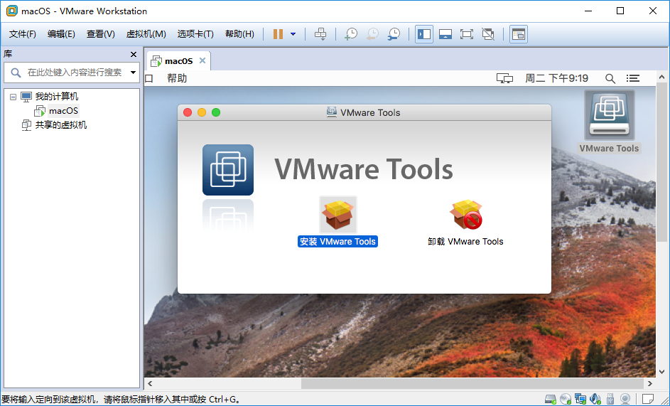

安装完成后关闭虚拟机，在重新设置虚拟的的 `CD/DVD -> 连接` 选项，这回设成 `使用物理驱动器`

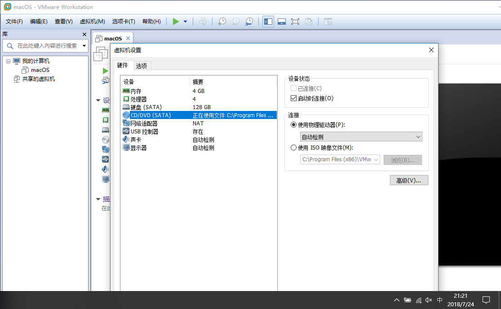


---


**至此，安装工作全部结束了!**
